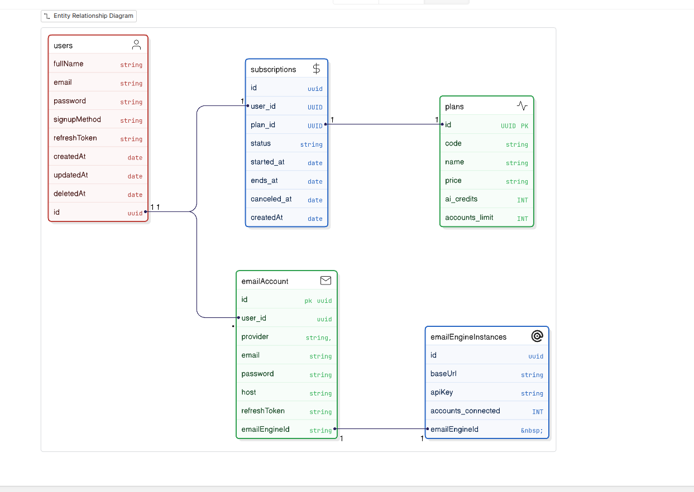

## Day 1 : ( Jan 15 , 2026)

- As i am more of a backend guy , and i believe in backend-first approach , i started by setting up the repo
  for backend ( self hosting ElasticSearch and kibana took most of my time :) , but it was all worth it !!!
  only 1 thing that i have to choose a 4gb ram VM , so that the elastic / email-engine and redis and all backend along with
  workers etc works seamlessely in one vm ( that's a bad example of vertical scaling , but shit happens!!!! )
  i have very limited credits left and i have the challenge to make it work before my credits ran out :

- So it'll be my finest project so far , i want to keep it how people ( or senior engineers do it in the production )?
  but why ? "CAUSE IF YOU WANT TO BE X , START ACTING LIKE ONE RIGHT NOW "!!

so there are certain aspects or patterns i have to follow ? the end goal ?

- Consistency , availability , minimum down time , error/bug-free ( lol )
- then comes monitoring ,and obserability ( i think sentry will handle this for me ).
- then comes the scalability ( as i am not expecting a huge traffic now ) , i still have to follow some backend principles so that users get the right feel about the BETTERMAIL !!!!

## Day 2 : (Jan 16 ) CREATION OF THE DATABASE

- Database is the most cruical part while building a product , and i often suffer from the "Over-engineering disease" while building it everytime , the ideal thing to do here is make sure the requirements are clear here and just build it !
- you always have the option to change the schema once

So this is the initial plan i came up with (ofcourse there's always a room for improvment )but we'll continue building and will fix stuffs later !!! 

