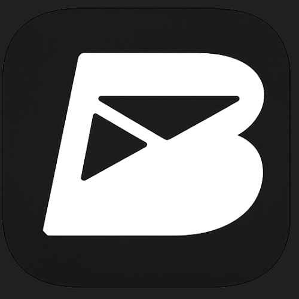

<div align="center">



# BetterMail

**An open-source, fast, and minimal email client built for productivity and AI.**  
_Hit Inbox Zero faster with powerful keyboard shortcuts, AI capabilities, and instantaneous search._


</div>

<br />

> **Watch Demo**: [Demo Video to see BetterMail in action!](https://www.linkedin.com/embed/feed/update/urn:li:ugcPost:7436009828289908736?compact=1)

---

## Getting Started & Setup

Want to contribute or run this locally? Here is how to get your local development environment up and running.

### Prerequisites

- Node.js (v18+)
- pnpm
- PostgreSQL
- Redis
- Elasticsearch

### 1. Clone the repository

```bash
git clone https://github.com/nerdyabhi/better-mail.git
cd better-mail
```

### 2. Backend Setup

Navigate into the backend and install dependencies:

```bash
cd backend
pnpm install
```

Create a `.env` file in the `backend/` directory with your actual variables:

```ini
# Sentry
SENTRY_DSN= #For monitoring and logging

APP_PORT=3001

# DATABASE
PG_CONNECTION_STRING=

# REDIS
REDIS_HOST=
REDIS_PORT=
REDIS_PASSWORD=

OUTLOOK_CLIENT_STATE=
OUTLOOK_WEBHOOK_URL=

ELASTIC_API_KEY=
ELASTIC_NODE=
ELASTIC_PASSWORD=

# STARTER_PRICE_ID=
# PRO_PRICE_ID=
# BUSINESS_PRICE_ID=

# STRIPE_PUBLISHABLE_KEY=
# STRIPE_SECRET_KEY=

JWT_SECRET=

CLOUDINARY_URL=
CLOUDINARY_CLOUDNAME=

GOOGLE_CLIENT_ID=
GOOGLE_CLIENT_SECRET=
GOOGLE_REDIRECT_URI=
GMAIL_PUBSUB_TOPIC=

OUTLOOK_CLIENT_ID=
OUTLOOK_CLIENT_SECRET=
OUTLOOK_REDIRECT_URI=
OUTLOOK_CONNECT_REDIRECT_URI=
GOOGLE_CONNECT_REDIRECT_URI=
MICROSOFT_TENANT_ID=common

# EMAIL_ENGINE_PASSWORD=
# EMAIL_ENGINE_ACCESS_TOKEN=

# BULLBOARD
BULLBOARD_USERNAME=
BULLBOARD_PASSWORD=
# Enable BullBoard in production (false by default for security)
BULLBOARD_ENABLED=true
# Development mode - allows access without auth (NEVER use in production!)
BULLBOARD_DEV_MODE=true

# AZURE OPENAI
AZURE_OPEN_AI_KEY=
GPT_41_ENDPOINT=
GPT_41_MODEL=
GPT_41_API_VERSION=
GPT_4O_MINI_ENDPOINT=
GPT_4O_MINI_MODEL=
GPT_4O_MINI_VERSION=

# EMBEDDINGS - OPENAI
EMBEDDINGS_ENDPOINT=
EMBEDDINGS_MODEL_NAME=
EMBEDDINGS_MODEL_DEPLOYMENT=

# SOKETI - APP CONNECTION
SOKETI_DEFAULT_APP_ID=
SOKETI_DEFAULT_APP_KEY=
SOKETI_DEFAULT_APP_SECRET=

TELEGRAM_BOT_TOKEN=
TELEGRAM_BOT_USERNAME=
FRONTEND_URL=
ALLOWED_IP=

AZURE_LANGUAGE_ENDPOINT=
AZURE_LANGUAGE_KEY=
```

Start the backend API and Background Workers:

```bash
# Terminal 1: Run the Express API
pnpm run dev

# Terminal 2: Run BullMQ background workers
pnpm run dev:worker
```

### 3. Frontend Setup

Open a new terminal, navigate to the `frontend/` directory, and install dependencies:

```bash
cd frontend
pnpm install
```

Create a `.env` file in the `frontend/` directory:

```ini
NEXT_PUBLIC_SITE_URL=http://localhost:3000

NEXT_PUBLIC_POSTHOG_KEY=
NEXT_PUBLIC_POSTHOG_HOST=https://us.i.posthog.com

NEXT_PUBLIC_API_URL=http://localhost:3001/api/v1

NEXT_PUBLIC_PUSHER_KEY=your-key
NEXT_PUBLIC_SOKETI_HOST="your soketi host"

NODE_ENV="development"
```

Start the Next.js development server:

```bash
pnpm run dev
```

Visit `http://localhost:3000` to see the app running!

---

## Project Structure

BetterMail uses a monorepo setup split into a robust frontend and backend. Here's a look at how the backend handles heavy lifting:

```text
backend/
├── src/
│   ├── apis/       # The Express API (controllers, routers, middleware, validations)
│   ├── shared/     # Database models, config, and shared queue definitions
│   └── workers/    # Heavy offloading: BullMQ workers for AI logic, sync, embeddings
```

- **apis/**: The main Express.js REST application logic.
- **shared/**: Setup for PostgreSQL (via Sequelize), Redis connections, Elasticsearch instances, etc.
- **workers/**: This is where scalability shines. Tasks like syncing massive Gmail/Outlook inboxes, talking to Azure OpenAI to map embeddings, and summarizing emails are pushed to robust BullMQ Background Workers. It completely frees up the API from heavy workloads.

---

## Architecture & Tech Stack


### Backend

- **Framework:** Express.js, TypeScript.
- **Database:** PostgreSQL (using Sequelize ORM).
- **Instant Search:** Elasticsearch allows fetching relevant emails and content blazing fast.
- **Caching & Queuing:** Redis & BullMQ. Long-running or heavy jobs are executed reliably by BullMQ. Using **BullBoard**, we can visually monitor queue and task states internally with a powerful dashboard.
- **Real-Time Pipeline:** Soketi provides high-throughput WebSocket infrastructure connecting the Node backend instantly to frontend users.
- **AI Core:** Azure OpenAI combined with Langchain, Langgraph, and conversational Agents maps text to dynamic vector embeddings and actions.

### Frontend

- **Framework:** Next.js 16 (App Router), React 19.
- **State & Caching:** Zustand + **TanStack React Query** for aggressive UI caching and stable external API data.
- **UI:** Custom, snappy components via Tailwind CSS v4, Framer Motion, and Radix UI.
- **Rich Text Editor:** Powered internally by TipTap.
- **Telemetry:** PostHog strictly handles product telemetry and behavior analytics perfectly.

---

## Why BetterMail?

Email hasn't fundamentally changed in decades. BetterMail brings email into the AI era with a dev-centric, keyboard-first approach:

- **Insanely Fast:** Next.js UI using TanStack Query, tightly coupled with robust Redis caching and an Express backend. Extensive tasks are queued straight to BullMQ workers to keep reads/writes quick.
- **Keyboard-First Design:** Navigate, read, reply directly using keystrokes without even grabbing a mouse.
- **AI-Powered Inbox:** Contexts are evaluated using smart language models directly processing custom Agents for intelligent actions and categorizations automatically.
- **Highly Extensible:** Full integrations wired out to Telegram bots (`grammy`), Slack, Notion, etc.

---

## Contributing

We love contributions! BetterMail is maintained by the community. Check out [open issues](https://github.com/nerdyabhi/better-mail/issues) to find something to work on.

1. **Fork the Project**
2. **Create your Feature Branch** (`git checkout -b feature/AmazingFeature`)
3. **Commit your Changes** (`git commit -m 'feat: Add some AmazingFeature'`)
4. **Push to the Branch** (`git push origin feature/AmazingFeature`)
5. **Open a Pull Request**

### Areas to Contribute:

- **Frontend:** Improve keyboard shortcut discoverability, refine tight animations, trace edge-case bugs in TipTap rendering.
- **Backend:** Further refine indexing models within Elasticsearch, test out and build new BullMQ workers (under `/backend/src/workers`), and fine-tune Agents running under Langchain pipelines.
- **Queue Monitoring:** Enhance BullBoard dashboard features or add new queue visualization tools.
- **Have an idea?** [Open an issue](https://github.com/nerdyabhi/better-mail/issues) and let's discuss!

---

<div align="center">
  <b>If you like BetterMail, don't forget to leave a star 🌟!</b><br>
  Built with ❤️ by <a href="https://github.com/nerdyabhi">@nerdyabhi</a> and Contributors.
</div>
